<p align="center">
  
</p>

<h1 align="center">Localhost 8787</h1>

<p align="center">
  Your Android phone becomes a small, private server. Your laptop opens it in a browser.<br>
  Clipboard, files, music, notifications and control move between them: in the same room over a
  cable or the air, and from anywhere through the phone's own tunnel and website.<br>
  Phones link with each other too, and message each other with nothing in between.
</p>

<p align="center">
  <a href="../../releases/latest"><b>Download the app</b></a>
</p>

<p align="center">
  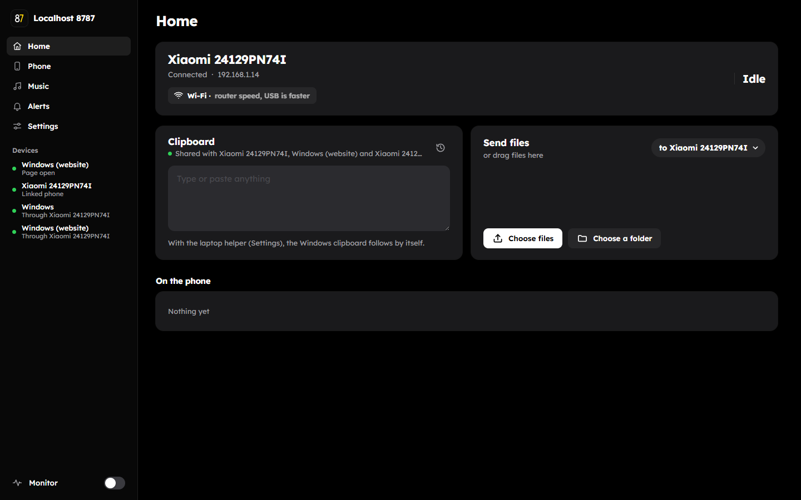
</p>

| Home | Devices | A conversation | Music |
| --- | --- | --- | --- |
| 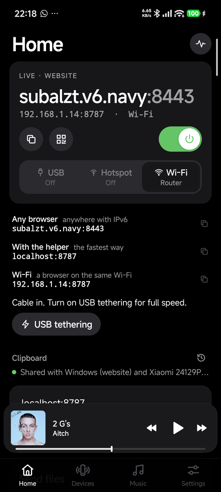 | 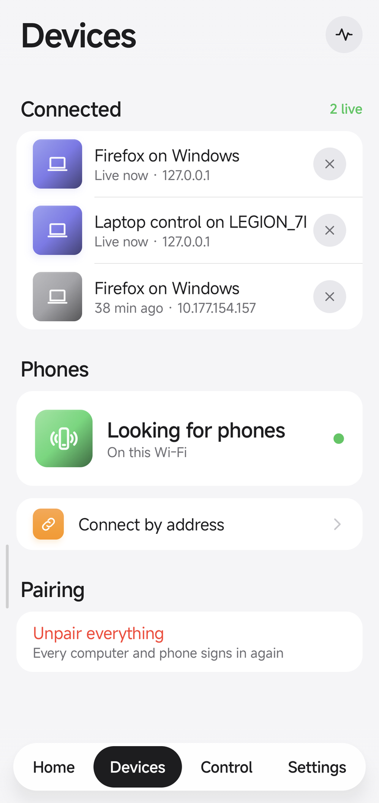 | 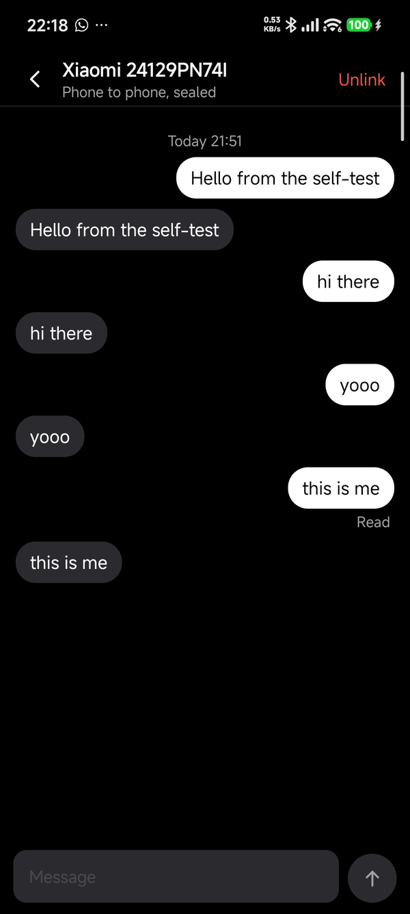 | 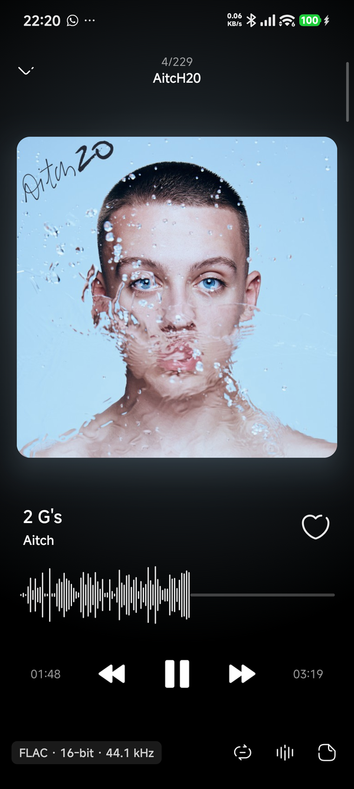 |

**Contents:** [Speed](#-speed) ·
1 [Connect a computer](#1-connect-a-computer) ·
2 [Every way in the same room](#2-every-way-in-the-same-room) ·
3 [Who is connected, and how](#3-who-is-connected-and-how) ·
4 [From anywhere: the tunnel](#4-from-anywhere-the-tunnel) ·
5 [From anywhere: the phone as a website](#5-from-anywhere-the-phone-as-a-website) ·
6 [Clipboard](#6-one-clipboard-for-both) ·
7 [Files](#7-send-files-and-whole-folders) ·
8 [Browse the phone](#8-browse-the-phone-from-the-laptop) ·
9 [Music on the laptop](#9-your-music-on-the-laptop) ·
10 [Music on the phone](#10-music-on-the-phone-itself) ·
11 [Lyrics](#11-lyrics-found-and-saved-by-themselves) ·
12 [Notifications](#12-the-phones-notifications-on-the-laptop) ·
13 [Trackpad](#13-the-phone-as-trackpad-and-keyboard) ·
14 [Phone screen](#14-the-phones-screen-on-the-laptop) ·
15 [The laptop's screen](#15-the-laptops-screen-on-the-phone-from-anywhere) ·
16 [Monitor](#16-a-live-monitor) ·
17 [Measure](#17-measure-the-connection) ·
18 [Phone and phone](#18-phone-and-phone) ·
19 [Messages and calls](#19-messages-and-calls-phone-to-phone) ·
20 [Laptop and laptop](#20-laptop-and-laptop) ·
21 [Back](#21-back-works-as-in-an-app) ·
22 [Any browser](#22-any-browser-any-computer) ·
23 [The look](#23-the-look) ·
[Getting started](#getting-started) · [Under the hood](#under-the-hood) · [Known limits](#known-limits)

---

## ⚡ Speed

| How they are connected | Phone → laptop | Laptop → phone | Laptop keeps internet |
| :--- | ---: | ---: | :--- |
| **USB-C cable** (USB 3, USB tethering on) | **224–235 MB/s** | **257–271 MB/s** | Yes |
| **The phone's hotspot** | 59–83 MB/s | 64–65 MB/s | Yes, through the phone |
| **Direct link** (the phone's own private network) | 55–101 MB/s | 54–115 MB/s | No |
| Home Wi-Fi, through the router | 7.1–9.2 MB/s | 6.0–6.1 MB/s | Yes |
| USB 2 cable (most charging cables) | about 41 MB/s | about 40 MB/s | Yes |
| Across the internet (Airtel home broadband ↔ phone on Jio data) | 0.13–0.15 MB/s | 0.13–0.22 MB/s | Yes |

Measured between a Xiaomi 15 and a Wi-Fi 7 laptop (24 September to 3 October 2026), with the
data made and thrown away on the spot so only the connection counts. The router here runs a narrow
20 MHz channel, which is why it is the slowest local way; see [Faster over the air](#faster-over-the-air).

The app itself is not what limits these. Against a bare TCP connection with no app at all it
matches the connection both ways, on the cable and on the hotspot, and a real 2 GB file, written
to the phone's storage, moved at 238 MB/s to the phone and 230 MB/s back over the cable. The
website's encryption keeps up too: on the hotspot it measured 89 MB/s against 90 for plain HTTP.

Across the internet the limit is the road between the two carriers, the same for every way
across it (the website, the tunnel, one connection or four). That is enough for the page, the
clipboard, files and messages. For music it is too little for 24-bit lossless (0.3–0.6 MB/s), so
music across the internet steps down by itself the way music apps do (section 9).

---

## Features

### 1. Connect a computer

Flip the switch at the top of the phone's Home. The phone shows its address in large type; tap it
to copy, or show a QR code. Open that address on the laptop, click **Ask to connect**, and tap
**Allow** on the phone (both show the same 4-digit code). No account, no password, no PIN. The
phone lists every computer and phone allowed in, and can remove any.

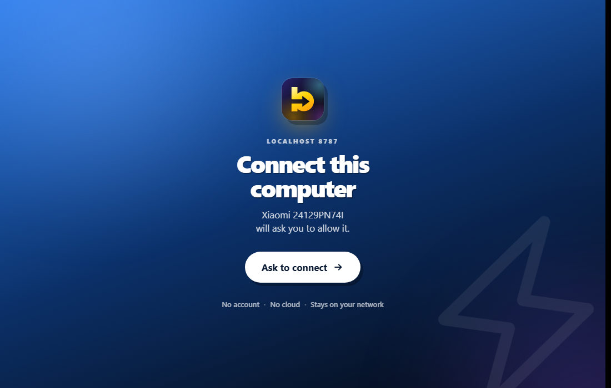

### 2. Every way in the same room

From the simplest up. Each line is the short version; **click it for the full explanation.**

<details>
<summary><b>The same Wi-Fi.</b> Both on your router. Nothing to set up; the slowest way.</summary>

<br>

**Path:** laptop → router → phone. Two hops through the air.

Open the address the phone shows (for example `192.168.1.14:8787`) in any browser on the laptop.
It works on any Wi-Fi where devices can see each other: your home router, an office network. Every
byte crosses the air twice, once to the router and once from it, and the slower of the two links
decides the speed. Here that is 7–9 MB/s, because the router uses a narrow channel.

Some Wi-Fi networks (guest networks, most campus and hotel networks) keep devices from seeing
each other. There the page will not open; use the hotspot or a cable instead.

</details>

<details>
<summary><b>The phone's hotspot.</b> The laptop joins the phone's hotspot and stays online through it. About 65–83 MB/s.</summary>

<br>

**Path:** laptop → phone. One hop through the air.

Turn on the phone's ordinary hotspot and join it from the laptop. The phone is now the laptop's
router, so there is only one hop between them, and the laptop keeps its internet through the
phone. *Settings → Speed → Laptop link* shows the hotspot's name and password, so the laptop helper
can join it by itself.

</details>

<details>
<summary><b>A USB-C cable.</b> USB tethering on. About 250 MB/s, the fastest by far.</summary>

<br>

**Path:** laptop ⇄ phone over the cable, no radio at all.

Plug in and turn on USB tethering (Home offers the button as soon as a cable is plugged in). The
phone becomes a network adapter on the laptop, at USB speed: 224–271 MB/s with a USB 3 cable. The
laptop keeps its internet through the phone. Most charging cables are USB 2, which tops out near
40 MB/s; the app tells the two apart and says so.

</details>

<details>
<summary><b>The direct link.</b> A private network the phone starts by itself. 55–115 MB/s, no internet.</summary>

<br>

**Path:** laptop → phone. One hop, on a network only the two of you are on.

*Settings → Speed → Laptop link → Direct link → Start.* The phone starts a network of its own
(Android's local-only hotspot) with a random name and password; the laptop helper joins it without
asking. It is as fast as the hotspot or faster, but it has no internet, so the laptop is offline
until it stops. Android allows one hotspot at a time: the app says when the ordinary hotspot is in
the way.

</details>

<details>
<summary><b>USB debugging.</b> The helper's last resort: works with no network between them at all.</summary>

<br>

**Path:** laptop → adb over the cable → phone.

When the laptop cannot reach the phone over any network (the phone on another Wi-Fi, tethering
off) but the cable is in and *USB debugging* is on, the laptop helper forwards a port through
`adb` and serves the phone at `127.0.0.2` as if it were on the network. The page, the clipboard,
the trackpad and the laptop's screen work (the screen at 4K, 120 frames a second). It is slower
than tethering for files (about 30 MB/s), and the page says *USB tethering is faster*. The helper uses the Android SDK's `adb`, or
the one that comes with scrcpy.

</details>

<details>
<summary><b>The laptop helper.</b> One address, <code>localhost:8787</code>, always on the fastest way there is.</summary>

<br>

**Path:** browser → the helper on the laptop → whichever way is fastest → phone.

On Windows, double-click **blazeit-pc.bat**; on Linux, run `python3 blazeit-linux.py` in a
terminal; on a Mac, `python3 blazeit-mac.py` in Terminal. The page's Settings offers the one for
the computer it is open on, and nothing is installed. The helper finds the phone by itself, over
the cable, the hotspot, the direct link, Wi-Fi, USB debugging, and from far away over the tunnel
(section 4), and moves to a faster way the moment one appears and back when it goes. The page stays
at `http://localhost:8787` whichever it is, so bookmarks and open tabs never change. Starting it
again replaces the running copy. Downloaded through the phone's website, it signs itself in.

The Linux helper needs only Python 3 and uses what the system has: `wl-clipboard` (Wayland) or
`xclip` (X11) for the clipboard; write access to `/dev/uinput`, or `xdotool` (X11), or `ydotool`,
for the trackpad and keyboard; `pactl` or `wpctl` for the volume; `nmcli` to join the direct link;
`scrcpy` for the phone's screen; `ffmpeg` (X11) or `wf-recorder` (sway, Hyprland) for the second
screen. It says what is missing when something needs it. Under WSL it names itself *Linux* and
leaves the trackpad and the second screen to the Windows helper.

On a Mac the same file uses what macOS has: `pbcopy`, `pbpaste` and AppKit for the clipboard
(text, pictures, a file), Quartz events for the trackpad and keyboard, AppleScript for the volume,
and from [Homebrew](https://brew.sh) `ffmpeg` for the second screen and `scrcpy` for the phone's
screen. macOS asks once for **Accessibility** (the trackpad) and **Screen Recording** (the second
screen) for the app the helper runs in. The phone's Windows shortcuts come out as the Mac's: Ctrl+C
is ⌘C, the app switcher is ⌘-Tab, three fingers up is Mission Control, four fingers change Space.
To use the phone's hotspot or direct link, join it from the Wi-Fi menu; the helper follows the
phone there. A USB cable works when the phone's USB tethering uses NCM, which macOS supports
(it has no RNDIS).

</details>

### 3. Who is connected, and how

The phone's **Devices** tab lists every computer allowed in, and says **how each one is connected
right now**: its icon is the way it came (the cable, the hotspot, Wi-Fi, the direct link, USB
debugging, the website's lock, the tunnel's link), and under its name the same in words and
whether it is the helper or a browser (*Same Wi-Fi · Browser*), then what that way runs over and
about how fast it is (*IPv4 · as fast as the router*). Quiet ones say when they were last here;
**×** removes one. The page says the same in its hero (*Wi-Fi · router speed, USB is faster*) and at
the foot of its Settings, where the helper card names the link and the phone's address on it.

| On the phone | On the page |
| --- | --- |
|  | 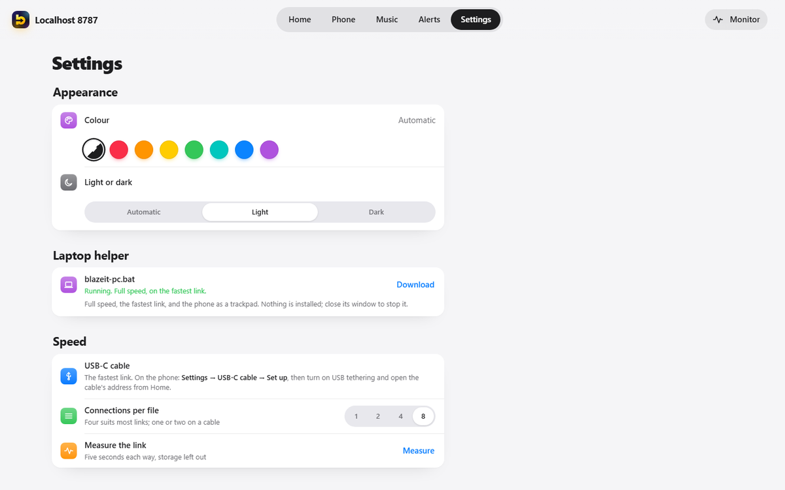 |

### 4. From anywhere: the tunnel

Pair once on the same network (or link a phone with a code, section 18). After that, a laptop
helper or a linked phone on another network reaches the phone through its **tunnel**: one connection with its own encryption and every request
carried inside it ([how it works](docs/tunnel-protocol.md)). The phone is the only server; there is
none on the internet. The helper and linked phones learn the phone's address while they are
together, switch to the tunnel by themselves when no local way answers, and come back when one
does.

- **Over IPv6**, straight to the phone's mobile-data address over TCP.
- **Over IPv4**, from a network with no IPv6: the laptop (or the other phone) and the phone swap their public IPv4
  addresses as two small sealed notes on a public message board ([ntfy.sh](https://ntfy.sh), which
  keeps nothing), then **punch through both NATs** over UDP and run the same tunnel on that path,
  with its own delivery and congestion control (CUBIC). Nothing but those notes goes through anyone
  else. It works unless both networks have the hard kind of NAT (a new port for every
  destination); from Airtel home broadband to a phone on Jio data it takes 5 to 9 s.
- **When the phone's address changes** (mobile IPv6 changes whenever the phone reconnects), the
  helper asks the phone where it is now through the same message board and is back in about 3 s.
- **On the page** the link shows as *Internet · IPv6 tunnel* or *Internet · IPv4, punched through*,
  and the page goes easy on it: the next song waits until the playing one has fully arrived.

Through the tunnel: the clipboard, files, browsing the phone, music, notifications, the trackpad,
and the laptop's screen on the phone (section 15). The phone's screen on the laptop stays local. The phone stays awake while anyone is
connected from far away, and for half a minute after. *Settings → Laptop access → From other
networks* shows who is connected that way and how much it has carried, and turns it off.

<details>
<summary><b>What works across different networks, and what does not.</b></summary>

<br>

| Situation | Works? |
| :--- | :--- |
| Laptop and phone on the same Wi-Fi, hotspot or cable | Yes |
| Laptop and phone on different networks, cable plugged in | Yes, through USB debugging |
| Laptop on another network with IPv6, phone on mobile data | Yes, through the tunnel or the website |
| Laptop on a network with IPv4 only, phone on mobile data | Yes, the helper punches through both NATs over UDP, unless both are the hard kind |
| Two phones far apart, on mobile data | Yes, through the tunnel, once linked |
| Two phones that have never been on the same network | Yes: link them with a code (section 18) |
| Two laptops on different networks, one phone | Yes: straight between the laptops when both have IPv6, else through the phone |
| Two laptops, each on its own phone's hotspot | Yes, through both phones; from far apart, over the tunnel between the phones |
| Guest or campus Wi-Fi that hides devices from each other | Through the tunnel or the website if the network has IPv6; else use a hotspot or a cable |
| A proxy that allows only web traffic | No: it cannot reach the phone without a server outside |

</details>

### 5. From anywhere: the phone as a website

With a free name from [dynv6](https://dynv6.com) set up in *Settings → Website*, the phone is also
`https://yourname.v6.navy:8443` to any browser on a network with IPv6, nothing installed. It has a
real [Let's Encrypt](https://letsencrypt.org) certificate it gets and renews by itself. A browser
there clicks **Ask to connect** and you tap **Allow** on the phone, as on the local network
(anyone who finds the name can make the phone ask, so at most 10 asks per 10 minutes from one
network and 60 an hour). [How it works](docs/website.md).

- **The name follows the phone**: mobile data's own IPv6 (the carrier lets connections in; a home
  router usually does not), or, while the phone shares its data over the hotspot or USB tethering,
  its address on that side, which works there and from the internet alike.
- **At home** the website moves itself to `lan.yourname.v6.navy`, the phone's Wi-Fi address, in
  the same certificate, instead of going out to the internet and back.
- **Near the phone** (its hotspot, the cable, its Wi-Fi) the website moves to the phone's plain
  address there, the old `http://IP:8787`, still signed in: a one-time code carries the sign-in
  over, so the phone does not ask again. If that address does not open, Back returns to the website,
  which stays.
- **The helper from the website**: its download signs itself in with a code baked into it; started
  anywhere, it finds the fastest way by itself.
- Over the internet everything stays encrypted (HTTPS, or the tunnel). **On the phone's own
  networks too**: the laptop helper and linked phones talk to it through the same encrypted
  tunnel on Wi-Fi, its hotspot and the cable, so someone else on a shared Wi-Fi sees nothing but
  noise. It costs no speed: the tunnel's frames are AES-256 in the processor's own AES
  instructions (about 700 MB/s on the laptop, more than any link here carries). A browser opened
  at the phone's own address is still plain; the helper's `localhost:8787` is the sealed way.
- **Quick to open on a slow link**: the page goes out compressed, 145 KB instead of 547, so a
  phone's browser across the internet shows it in a moment instead of a blank page; after that the
  browser keeps it and only asks whether it changed, one round trip instead of the whole page.

### 6. One clipboard for both

Copy on one, paste on the other: text, pictures and files up to 50 MB. The box on Home shows what
is shared, and under its title **Shared with** names every machine it reaches right now, on the
phone and on every page: *Shared with Xiaomi 15, LEGION_7I and Linux*. Machines go by their name,
never their browser; a browser in WSL is *Linux*. **History** (the clock) brings back the last 30
items and closes by itself after ten seconds; with nothing in it, the clock just says *Nothing to
clear*. **Clear history** empties the history and the clipboard everywhere. With the laptop
helper running it all happens by itself both ways, including **every screenshot** you take on
the phone. To send copies from any phone app straight away, allow two things once over USB:

```bash
adb shell pm grant dev.periy.bridge.debug android.permission.READ_LOGS
adb shell appops set dev.periy.bridge.debug SYSTEM_ALERT_WINDOW allow
```

On HyperOS the phone may still keep its clipboard to itself in the background: share to
**Copy to laptop**, or use *Send to laptop* on selected text, and it goes across at once.

### 7. Send files and whole folders

- **Laptop → phone**: drop files or folders on the page. Big files go over several connections at
  once and carry on where they stopped if the connection drops.
- **Laptop → another computer or phone**: the **to …** menu on *Send files* (section 20).
- **Phone → laptop**: share anything to Localhost 8787 from any app, or tap *Send files* on Home.
  It appears under *On the phone* on the page.
- Nothing can be deleted from the laptop. On the phone, *Clear* takes files off the list only.

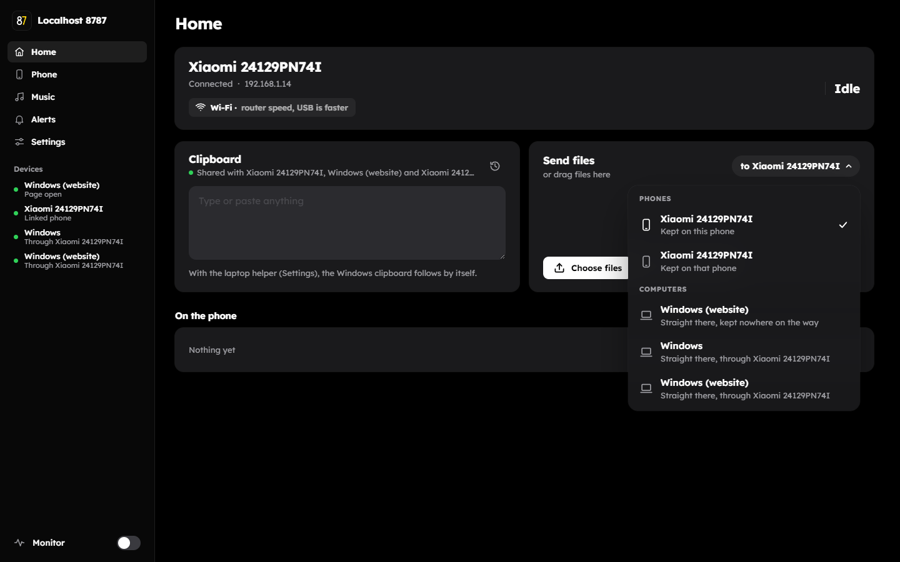

### 8. Browse the phone from the laptop

The page's **Phone** tab shows the phone's folders with thumbnails, and those of linked phones.
Click a file to see it before downloading: photos (HEIC too), videos, music, PDFs, text and Office
files, full screen with arrows to step through. Download one file or a whole folder as a zip.
Read-only, and off until you allow it on the phone.

| The phone's folders | A picture, previewed |
| --- | --- |
| 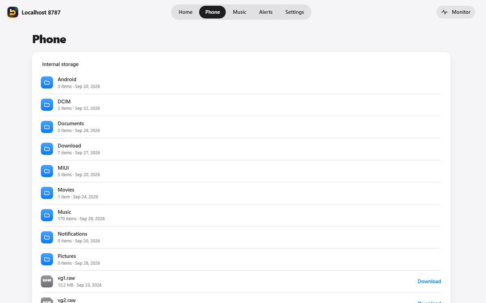 |  |

### 9. Your music, on the laptop

The page's **Music** tab is the phone's Music (section 10), fitted to the window: on a laptop
Albums, Songs and Favourites sit under Music in the sidebar, in a phone's browser it takes the whole
screen. Songs stream straight from the phone in their own format (FLAC, 24-bit included), so
skipping is instant on a local link. Media keys and the Windows media overlay work. **Ctrl K**
finds any song or album from anywhere on the page.

| Albums | Songs |
| --- | --- |
| 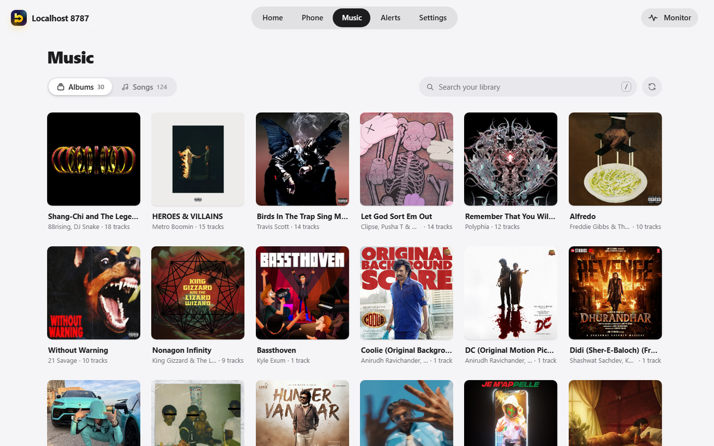 | 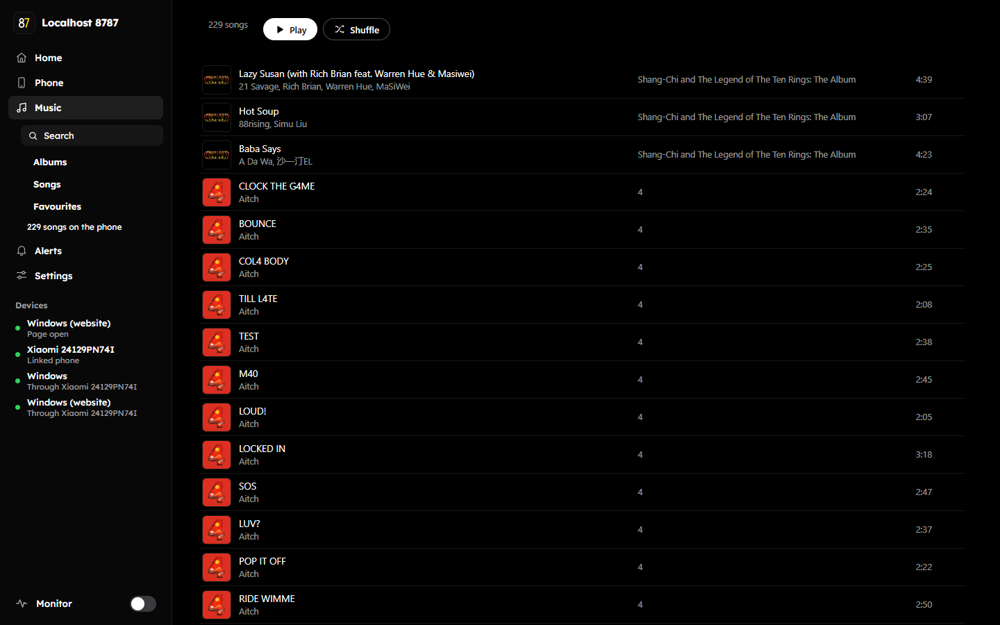 |

- **An album** opens as a page pushed in from the right, its cover flying from its card into the
  frame at the top, with **Play**, **Shuffle**, its genre and what the files are (*FLAC · 24-bit ·
  96 kHz*), its order (disc number, title, duration or artist, either way round) and a header
  before each disc.
- **The song playing** sits on a lifted card with a hairline round it, in every list and album, so
  it is found at a glance.
- **The player, full screen**, moves as [Namida](https://github.com/namidaco/namida)'s does, with
  its times and curves: every move up or down settles over 300 ms, a song sideways over 600. Drag
  the mini player up (or click its cover) and it grows into a player the size of the window, with
  what plays next beside the cover. The colour is the cover's, and faint specks drift behind,
  quicker when the music is loud. Under the waveform, **what the file is** (FLAC, 24-bit, 96 kHz,
  its bitrate). `Esc` or Back steps back down.
- **The seek bar is the song's own waveform, live.** While it plays, what has played stays as
  bars, the last dozen rising and falling with the music like a level meter, and what is still to
  come is a plain bar. Paused, pointed at or dragged, the whole song is bars again to choose a
  place in (drag up off it to take the seek back).
- **Across the internet it starts at once and steps down by itself**, as Spotify and Apple Music do. The page
  measures the link and asks for what it carries: the song's own file when there is room, else a
  CD-quality FLAC copy (16-bit, 44.1 or 48 kHz), else AAC at 256, 128 or 64 kbps. The phone sends
  the copy while it is still making it, so a song starts within a second (it took 8 to 10 before),
  keeps it (up to 1 GB), and makes the next song's alongside. The line
  under the waveform says what you are hearing (*AAC 128 kbps for the internet*).
- **Light across a slow link**: the song list goes out compressed (9 KB instead of 60) and again
  only when it changed; rows and album tiles get small WebP covers (7 KB and 34 KB instead of
  about 140), and only the player shows the full one.
- **The queue**: drag on up for every song in the order it will play, to play from, drag into a
  new order by its handle, or take off. The broom removes the songs before or after; **Shuffle**
  shuffles only what is left.
- **Repeat** opens Namida's menu: stop after the last song, repeat this song, repeat it a number of
  more times, repeat the queue, or repeat the queue shuffled anew each time round. The **sound
  controls** set speed and volume.
- **Hearts** are kept on the phone, so a song with a heart has it on the phone's player and every
  page. **Search** grows out of its button (or `/`); `Esc` clears it, then closes it.

| The player, playing | The queue |
| --- | --- |
| 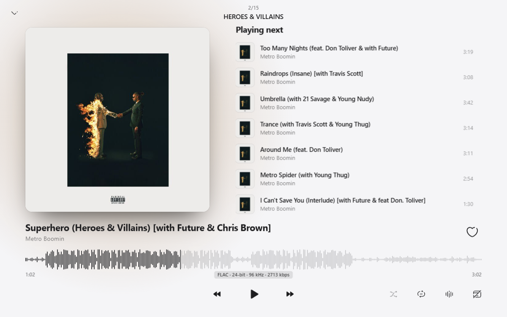 | 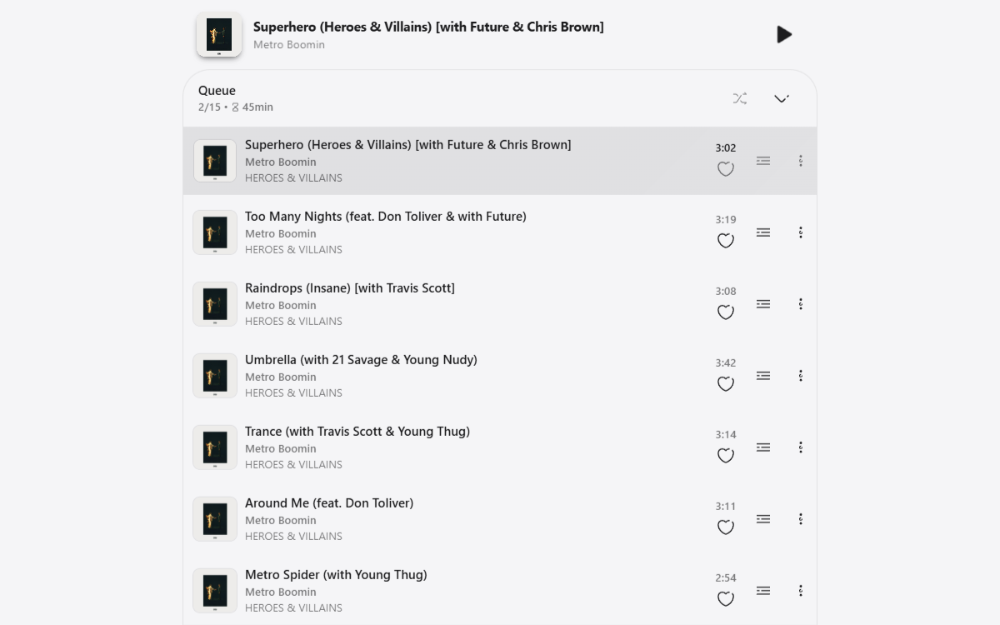 |

| An album | Ctrl K |
| --- | --- |
| 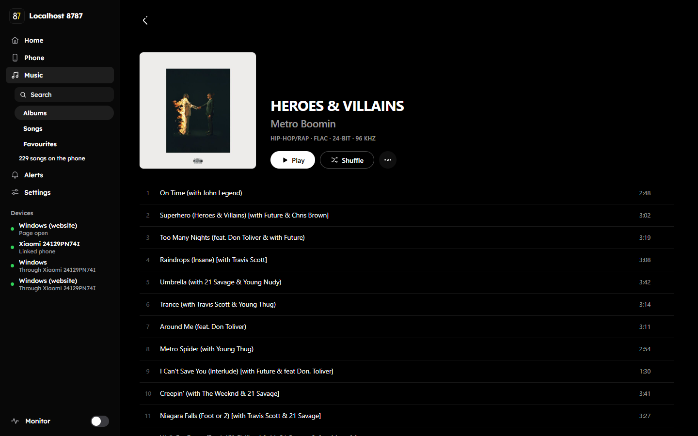 | 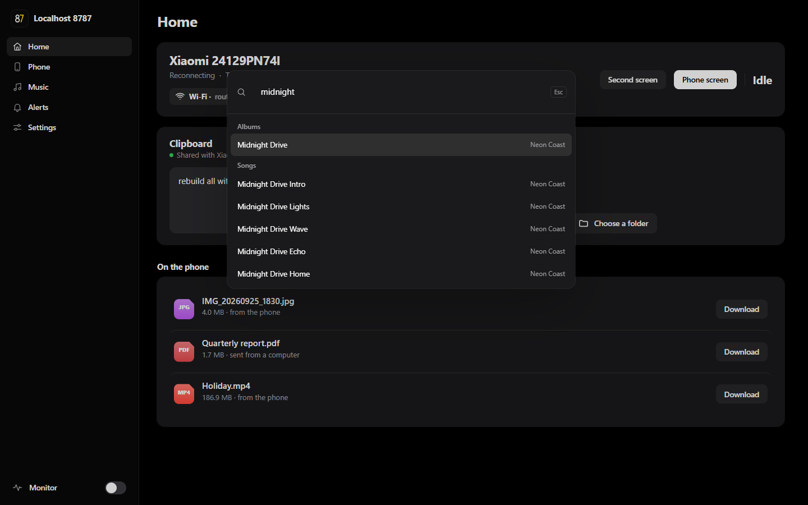 |

### 10. Music on the phone itself

The phone's own **Music** tab opens the phone's music full screen, laid out as
[Namida](https://github.com/namidaco/namida)'s library, in the colour of the song playing (Back
returns to the app). It plays on the phone: its speaker, headphones or a car, with Localhost 8787
in the background, the controls in the notification and on the lock screen, and a headset's
buttons working.

- **Tracks, Albums and Liked**, side by side under Namida's bottom bar: tap one or swipe between
  them. Each page's count, with shuffle and play all, sits beside the search.
- **Tracks**: every song A to Z, each with its cover, who it is by, its album and year, what kind
  of file it is (lossless ones in the song's colour), how long it is, a heart, and a menu (play
  next, play last, go to its album). **Pull a song left** and *Play After* shows from under it.
- **Albums**: three to a row, each cover with its year frosted into a corner and a play button in
  the other. **An album**: its cover in a frame with its name, who it is by and its year,
  **shuffle** and **Play Last**, then its songs in the order you choose.
- **Namida's transitions**: an album opens as a page pushed in from the right, its cover flying
  from the grid into the album's header; songs and albums come in one after another; the page
  sinks back a little as the player opens over it. Namida's font, Lexend Deca, and its icons.
- **One continuous drag** from the mini player up to full screen and on up to the queue, and down
  again; swipe sideways for the song before or after, with a tick under the finger.
- **The cover swells** with the song's loud moments and **the seek bar is its waveform**, live as
  on the page: played bars with the last few moving with the music, the rest of the song faint
  ahead. Worked out once on the phone and kept (the page gets the same, from the phone).
- **The song playing** stands out on a lifted card in Tracks and in its album, and its album's
  card is marked too.
- **Sound controls**: speed, pitch and volume in Namida's Configure dialog (pitch in percent or
  semitones, a one-tap 432 Hz, speed carrying pitch if you like), kept for next time.
- **Equalizer** (Configure, Equalizer): ten bands from 32 Hz to 16 kHz with the curve drawn as it
  plays; drag a band's point, double-tap it for 0, or pick one of the famous curves (Harman, Loudness,
  Bass Boost, V-Shape, Vocal, Warm, Bright, Rock, Pop, Jazz, Classical, Electronic, Hip-Hop, Acoustic
  and more). Made the accurate way (Välimäki and Liski's cascade graphic equalizer): each filter's
  gain is solved so the curve passes exactly through the points, under half a dB of ripple between
  them, and the level comes down by the highest boost so nothing clips. Off, the sound is untouched.
  One setting for the phone (Android's DynamicsProcessing, 64 bands following the curve) and the
  page (Web Audio's own filters).
- **The queue**: Namida's sheet, rising under the song as the cover shrinks to the top. Tap to
  play, drag by the handle to move, swipe away to take off; the broom and **Shuffle** as on the page.
- Pull the mini player down under itself to stop and put it away. The queue is kept for next time.

Albums run on from one song to the next without a gap, and a call or another app's sound pauses
it.

| The library | Playing |
| --- | --- |
| 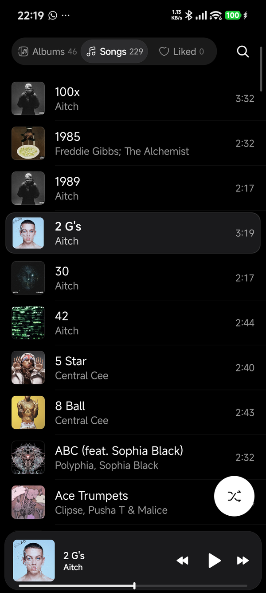 |  |

### 11. Lyrics, found and saved by themselves

Press the lyrics button in the player's bottom row: the words scroll beside the cover (over it at
a phone's width) with the song, the line being sung lit. Click a line to jump there. With word
timing, each word fills as it is sung; in a long instrumental gap, three dots swell until the
singing starts again. On the phone they ride over the cover too, and a tap opens them full page.

| On the laptop | At phone width |
| --- | --- |
| 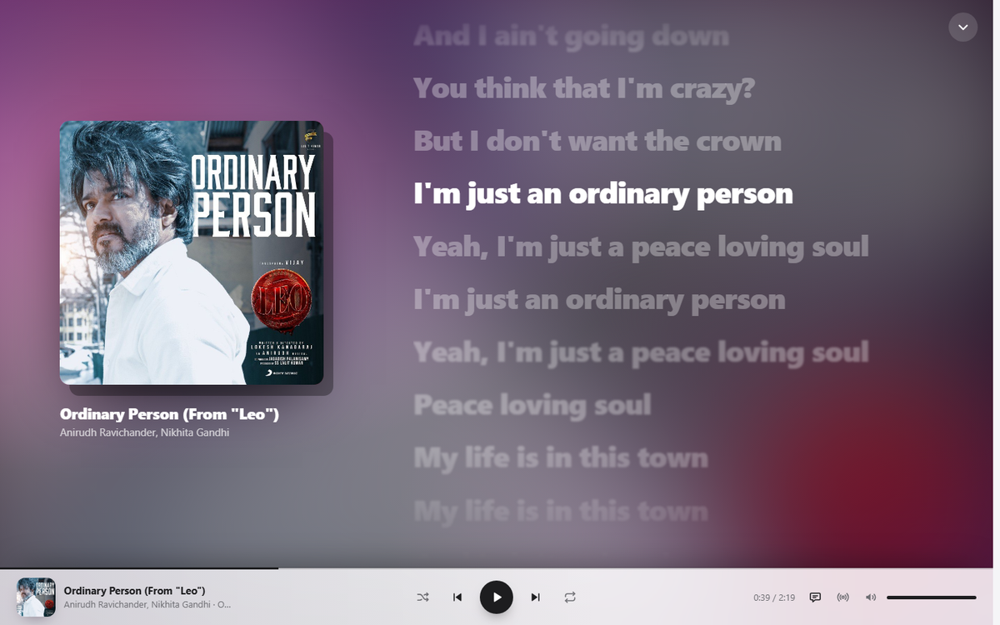 | 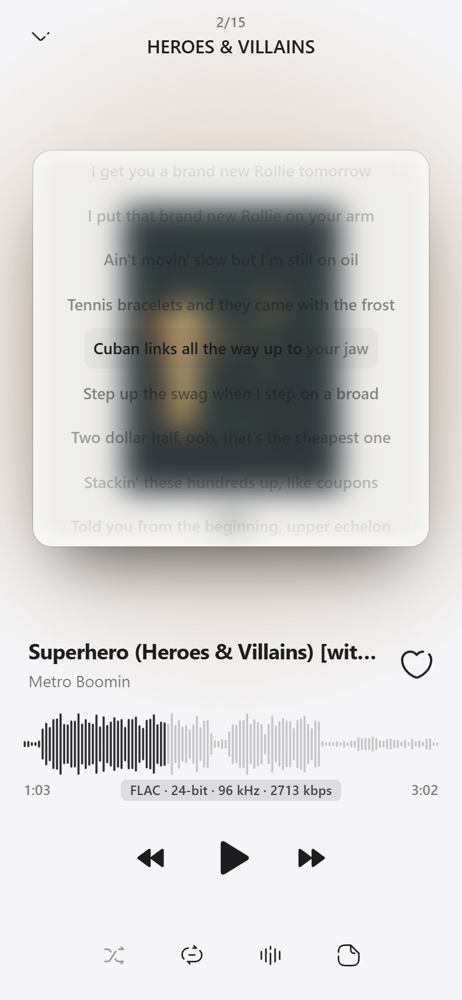 |

*The lyrics are blurred in these pictures; the app shows them sharp.*

- **Looked up by themselves.** When a song starts and the phone has no lyrics for it, the browser
  looks them up on [LRCLIB](https://lrclib.net), a free, open lyrics library (the phone does the
  same for songs it plays itself). Nothing is sent but the song's title, artist, album and length.
- **Downloaded and kept.** What is found is saved on the phone twice: in the app, and as a
  standard `.lrc` file **beside the song** in its music folder, which other players read too.
  A `.lrc` file already beside a song is used as it is and never overwritten. Saving them needs
  *All files access* for Localhost 8787 on the phone.
- **Word by word, worked out on the laptop.** LRCLIB times most songs by the line only. With the
  phone plugged in, run `tools\lyrics-align\align.bat`: it fetches each song not yet timed by the
  word, pulls the vocals out of the mix (Demucs), lines every word up with the singing (PyTorch's
  MMS_FA aligner, on an NVIDIA GPU when there is one) and gives the phone the lyrics back word by
  word. Run it again after adding songs; it skips the ones already done. The first run sets itself
  up in `tools\lyrics-align\venv` (Python 3.11 and ffmpeg needed, about 3 GB). Every song's lyrics
  as they were are kept in `tools\lyrics-align\backup`, and `align.bat usb --restore` puts them back.

### 12. The phone's notifications on the laptop

The page's **Alerts** tab shows the phone's notifications. Reply to a message, press their
buttons (*Mark as read*), or clear them, and it happens on the phone. Ongoing ones (music,
downloads) sit apart and never pop up. Needs *Notification access* on the phone.

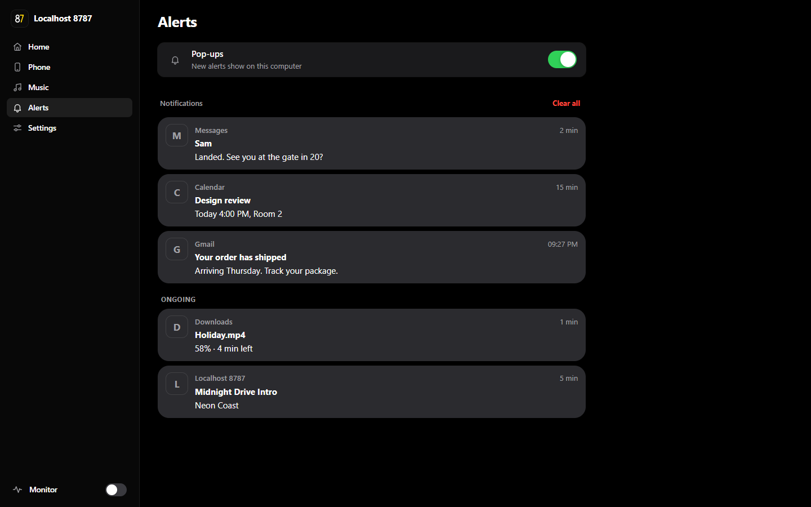

*Made-up notifications, for the picture.*

### 13. The phone as trackpad and keyboard

**Devices → Control** opens a trackpad for the laptop running the helper, on a screen of its own:
Windows gestures (two fingers to scroll, three for Task View, four to switch desktops), the
phone's keyboard typing into the laptop, and the laptop's volume and play/pause/next keys. It opens
**locked**: tap once to use it. The row says which computer it will drive, or that the helper is
needed.

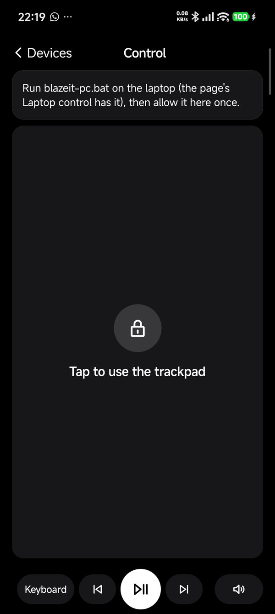

### 14. The phone's screen on the laptop

*Phone screen* on the page opens the phone in a window on the laptop, to use with the mouse and
keyboard, sound included (via [scrcpy](https://github.com/Genymobile/scrcpy); the phone needs USB
debugging on). It uses the cable when one is plugged in.

### 15. The laptop's screen on the phone, from anywhere

*Devices → Control → The laptop's screen* (or *Second screen* on the page) shows the laptop on the
phone, as scrcpy shows a phone on a laptop, the other way round, **with its sound**. Tap to click,
hold to right-click, drag to drag, two fingers to scroll, **pinch to zoom** in on small text (two
fingers then move round). **Keys** opens what Control's trackpad has: the keyboard, Esc, Tab,
Ctrl, Alt, Shift and Win (held for the next key or click, so Ctrl+click works), the arrows and
Del, and the laptop's media keys and volume.

- **In the same room** it is a second screen: with a virtual-display driver on the laptop
  (Windows) or an extra monitor set up with `xrandr` (Linux) it is a real extra monitor, else it
  mirrors the laptop's screen. Encoded on the laptop's GPU and decoded by the phone's hardware, up
  to 4K at 120 frames a second over the cable.
- **From anywhere**, through the tunnel: the laptop's own main screen, so you can use it while
  away. The laptop helper reaches the phone by itself, so the laptop needs nothing opened up. The
  picture is made to fit the link, starting where it last ended (700 kbit/s, 1024 wide at 20
  frames a second, the first time), its refresh spread over the frames so the stream stays even.
  The phone says what has arrived, and the laptop lets out only as much as the road takes to
  answer plus 0.3 s. As a video call does, a frame still waiting after half a second is dropped
  rather than shown late, so the phone shows the laptop as it is now; when many are dropped it
  steps down (to 854 wide, 15 frames a second, 250 kbit/s at the least), and after 20 calm
  seconds it steps up by half (on Windows to 1080p at 30 frames a second and 6 Mbit/s).
- **The sound** goes with the picture: what the laptop's speakers play (Windows' own loopback, or
  the Pulse monitor on Linux), as AAC at 160 kbit/s nearby and 64 from afar, late sound dropped so
  it stays with the picture. A Mac sends the picture only.
- The laptop needs to be on, awake and running the helper. Windows' lock screen and its
  administrator prompts are hidden from screen capture, and protected video (Netflix, Prime Video)
  shows black, as for any screen capture.

**Files on the laptop** (*Devices → Files on the laptop*): the laptop's usual folders and drives,
then any folder, from anywhere; a tap on a file saves it with what the phone has received. Read
only. It goes through the helper's own connection to the phone, so nothing on the laptop listens
and no port is opened.

### 16. A live monitor

The pulse button shows a small floating pill: speed each way, ping and signal, over any screen.
Tap it for the full picture: the last minute, how full the link is and with what, and the
session's peak and total. On the laptop, *Monitor* docks it down the right side.

| On the phone | Docked beside the page |
| --- | --- |
| 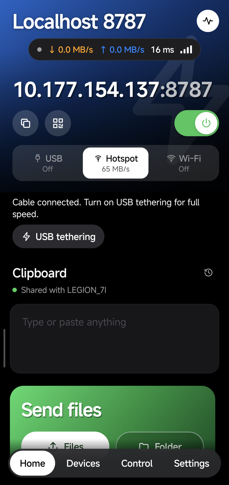 | 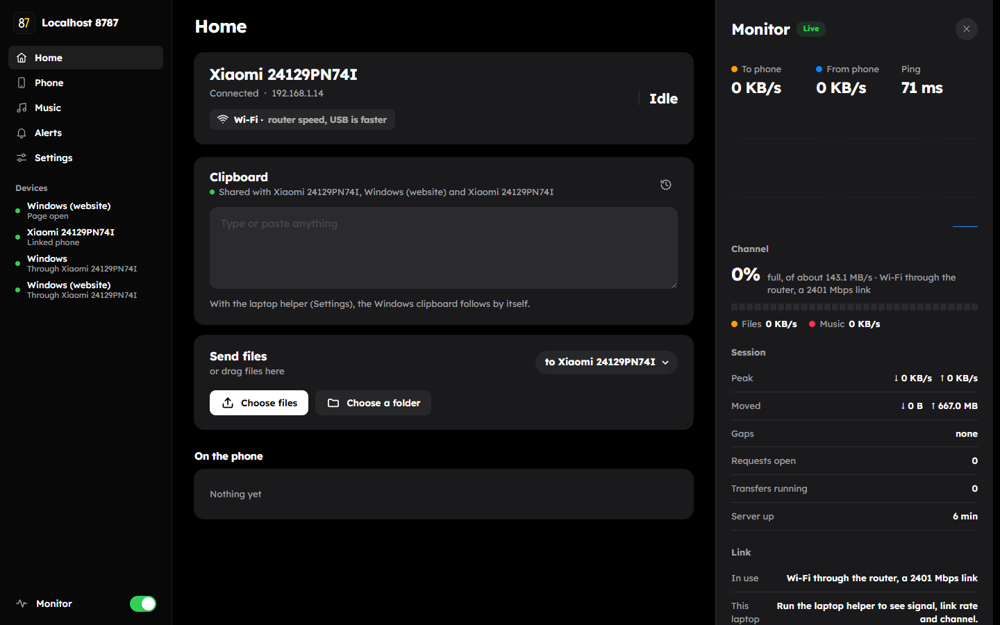 |

### 17. Measure the connection

*Settings → Measure the link* on the page tests the connection alone for five seconds each way.
Compare it with a real transfer: close means the network is the limit, far below means storage is.

### 18. Phone and phone

Linked phones have a tab of their own, **Phones**: each row is the conversation with that
phone (section 19), says how it is reached now (*Nearby · same Wi-Fi*, *Internet tunnel · IPv6*,
*Internet tunnel · punched over IPv4*), and has its files and a send on it.

<details>
<summary><b>Linking nearby.</b> Phones on the same network find each other; one approval links them both ways.</summary>

<br>

*Phones → Add a phone* looks for other phones running Localhost 8787 on the same network (they
announce themselves, as printers do). Tap **Link**, compare the 4-digit code, and tap **Allow** on
the other phone. That one approval links the two **both ways**: each can now reach the other
without asking again, for a year, renewed on its own. A phone the search cannot see (some Wi-Fi
keeps phones from seeing each other) links with a code instead, below.

</details>

<details>
<summary><b>Linking from anywhere.</b> One phone shows a code, the other types it in. Never on the same network.</summary>

<br>

*Phones → Show a link code* gives four digits, open for five minutes. On the other phone,
anywhere in the world, *Enter a link code* and type them. The code never travels: the two phones
use it in a key exchange (SPAKE2, as Magic Wormhole does) that hands the typing phone the code's
real secret, 32 random bytes, and only a phone that knows the code can finish it. Watching the
board tells nobody anything; a guess is one try, three per code. With the secret that phone finds
this one and reaches it through its tunnel, over IPv6 or punched across IPv4, and asks to be let
in exactly as on a shared Wi-Fi: compare the 4-digit code, tap **Allow**. Once linked,
each phone holds the other's own tunnel keys, so the link keeps working from anywhere, and the
code closes. Both phones turn on *From other networks*. [How it works](docs/tunnel-protocol.md#link-codes).

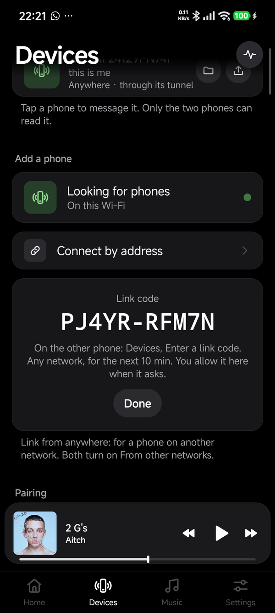

</details>

<details>
<summary><b>Far apart.</b> Linked phones reach each other on any network.</summary>

<br>

When a linked phone does not answer on the local network, the other reaches it through its
tunnel: its known IPv6 addresses first, then the ones it gives through the message board now
(mobile IPv6 changes), then a path punched across IPv4, the same three steps the laptop helper
takes. The phone moves back to the local network as soon as the other answers there.

</details>

<details>
<summary><b>Each other's files.</b> A linked phone's folders open on this phone and on the laptop.</summary>

<br>

The folder on a linked phone's row opens its folders, with thumbnails; save a file or a whole
folder here. On the laptop page, the **Phone** tab has a chip for each linked phone, so a laptop
connected to one phone can browse and download from the other. Read-only.

</details>

<details>
<summary><b>One clipboard.</b> Copy on one phone, paste on the other.</summary>

<br>

With *Sync clipboard* on, whatever is copied on one phone (text, a picture, a file) goes to every
linked phone, and from there to the laptops on it. The newest copy wins; a copy that came from a
phone is not sent back to it.

</details>

<details>
<summary><b>Sending between phones.</b> Big files go over several connections at once.</summary>

<br>

Send files from Home, from any app's Share menu, or with the arrow on a linked phone's row. Files
over 16 MB are split over up to 8 connections at once, in 64 MB pieces, and land in the other
phone's received-files folder.

</details>

### 19. Messages and calls, phone to phone

Tap a linked phone in *Phones* and write to it. **Each phone is the other's server**: a message
goes straight from one to the other, over the same Wi-Fi, through the tunnel, or punched across
IPv4, and nothing else ever holds it. No account, no number, no company.

- **Sealed for the two phones.** Every message is encrypted on its own (AES-256-GCM) with a key
  only the two phones hold, made when they linked, so even on a shared Wi-Fi it is unreadable to
  anyone else. Messages are kept only in the app's own storage on the two phones.
- **Waits instead of failing.** When the other phone cannot be reached, the message stays on
  yours, marked *Waiting*, and goes the moment it can (tried every 20 seconds).
- **Delivered and Read** under the newest of yours; a red count on *Phones* for what you have not
  read; a notification with the text, which opens the conversation.
- **Unlink** sits in the conversation's header, and asks first.

| A conversation | A call |
| --- | --- |
|  | 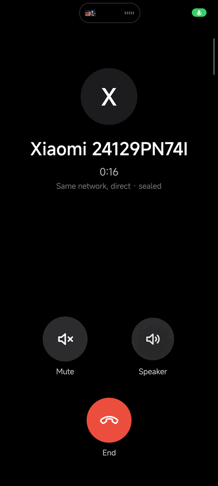 |

*In the pictures the phone is linked with itself: each message shows once sent and once received, and the call is to itself.*

**Calls, voice and video.** The handset in a conversation's header calls that phone; the camera
beside it makes a video call. Sound and picture go straight between the phones (WebRTC: Opus with
the phone's own echo cancelling and noise suppression, video in the phone's hardware codec), on the
same Wi-Fi, over IPv6, or punched across IPv4, and every call is set up over the same sealed channel
as messages, so its keys are known to the phones in it only. There is no relay server: when two
networks cannot reach each other at all, the call says so instead of going through anyone.

- **Ringing**: full screen, over the lock screen, the caller's avatar in its own colour with rings
  going out; **Decline** and **Answer**, or **Voice** and **Video** for a video call.
- **Under way**: **Mute**, **Camera** (on and off at any time, in a voice call too), **Flip**,
  **Speaker**, **Add** and **End**, how it goes (*Same network, direct*, *IPv6, direct*, *IPv4,
  punched through*) and that it is end-to-end encrypted. With pictures, the other phone fills the
  screen and yours sits in a corner you can drag to any other; the buttons fade after a moment and
  come back at a touch.
- **Group calls**: **Add** brings in another linked phone, up to four in a call, voice or video.
  Each phone connects straight to each other one (a mesh: no server, which is what about four phones
  can carry, each sending its picture to the others); the phone that started the call passes the
  setting-up steps on between phones that are not linked with each other, so only it needs to be
  linked with everyone. Everyone shows in a grid (two stacked, one over two, two by two), lit green
  while they talk, with a mark when muted.
- Registered with Android as a call, so Bluetooth headsets and car kits carry it and can hang it
  up, and it keeps going with the app in the background (camera too).

### 20. Laptop and laptop

<details>
<summary><b>Through one phone.</b> Two laptops on the same phone: the file streams through it, kept nowhere.</summary>

<br>

On the page, the **to …** menu on *Send files* lists every computer with the page open. Pick one:
the other laptop gets a card with **Save** and **Decline**, and on Save the file streams through the
phone as it is read. It is never written to the phone's storage, so a 50 GB file needs no room
there.

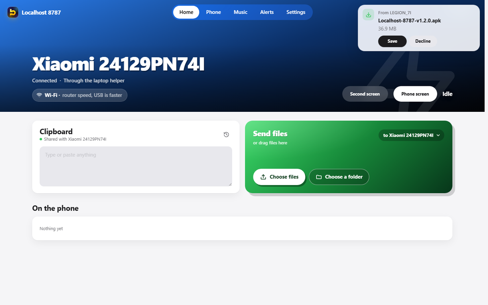

</details>

<details>
<summary><b>Through two phones.</b> Each laptop on its own phone, the phones linked.</summary>

<br>

The menu lists the computers on linked phones too (*a laptop · through the other phone*), and
the other phone itself. The file streams across both phones in one go and is stored on neither.
This is how two laptops on two different hotspots reach each other.

</details>

<details>
<summary><b>Direct, browser to browser.</b> When the two laptops can reach each other, the file skips the phones.</summary>

<br>

Before streaming through the phone, the two pages try to connect to each other directly
(WebRTC). The phones carry only the introductions, a few kilobytes, and answer STUN on UDP port
3478. If the laptops share a network the data flows straight from one browser to the other; if they
cannot reach each other within 8 seconds, the file goes through the phones by itself. In Chrome
and Edge the receiving laptop picks where to save; Firefox and Safari take a direct send of up to
512 MB in memory, and larger ones go through the phone.

</details>

### 21. Back works as in an app

- **On the phone**, Back closes whatever is open (the player a step at a time, a search, an album,
  Music, a conversation, Control, a linked phone's files, the clipboard's history), then returns to Home; at Home it sends
  the app to the background. It never closes the app, and the server keeps running. From Android
  14 the swipe shows it coming: what it would close follows the finger.
- **On the laptop**, the browser's Back steps back through the page: it closes the player, the
  lyrics, a file being viewed or the monitor, then returns to the tab before. Each tab has its own
  address (`#music`), so a reload or a bookmark opens it.

### 22. Any browser, any computer

The page is one file with no dependencies and works in Chrome, Edge, Brave, Opera, Firefox and
Safari, on Windows, macOS, Linux, ChromeOS, Android and iPad. It is checked in Edge and Firefox,
including over plain `http://`, where browsers switch off some features: there the page falls back
by itself (copying still works, a direct laptop-to-laptop file is held in memory or goes through
the phone). The laptop helper runs on Windows, Linux and macOS; everything else needs just a
browser.

### 23. The look

Quiet and black, the same on the phone and the laptop: OLED black, plain white cards, small grey
section labels, one accent at most. **The icon** is the port's own number, an 8 of two rings and a
yellow 7. On the phone, five tabs along the bottom (Home, Devices, Phones, Music, Settings): the
computers and Control in *Devices*, the linked phones, their conversations and adding a phone in *Phones*. On a computer the tabs run down a **sidebar**
with the devices under them and Music's library under Music, and **Ctrl K** searches songs,
albums and commands. Music keeps Namida's look, in the colours of the song playing. **Swipe left
or right** to move between tabs on the phone. **Colour** (*Settings → Appearance*, shared by the
phone and every open page): Automatic (black and white) or red, orange, yellow, green, mint, blue
or purple. **Light, dark or automatic** sits underneath.

| The page | Music on the page |
| --- | --- |
|  |  |

---

## Getting started

1. Install the APK from [Releases](../../releases/latest) (Android 10 or later).
2. Open **Localhost 8787**, go to **Settings**, choose where received files go, and allow
   notifications (and music, if you want the Music tab).
3. Flip the switch on **Home** and open the address it shows on the laptop. Tap **Allow**.
4. For full speed and the extras, get the laptop helper from the page's **Settings** and run it:
   **blazeit-pc.bat** on Windows, **blazeit-linux.py** on Linux (`python3 blazeit-linux.py`),
   **blazeit-mac.py** on a Mac (`python3 blazeit-mac.py`). Other computers need only the browser.
5. For the most speed, plug in a USB-C cable and turn on USB tethering, or use the hotspot.
6. For from anywhere: the helper does it by itself once paired. For a browser with nothing
   installed, set up the website in *Settings → Website* (a free dynv6 name and its HTTP token,
   and your own "I agree" to Let's Encrypt's terms).
7. For another phone: install the app there too, and link them in *Phones* (nearby, or with a
   link code from anywhere). Then tap it to message it.

Settings on the phone, top to bottom:

| Look, receiving and speed | The laptop link | Laptop access, music, keep running |
| --- | --- | --- |
| 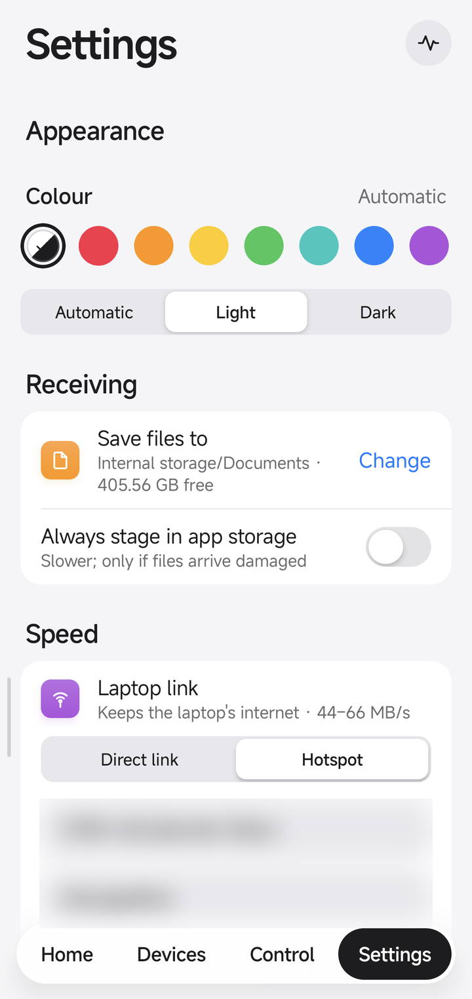 | 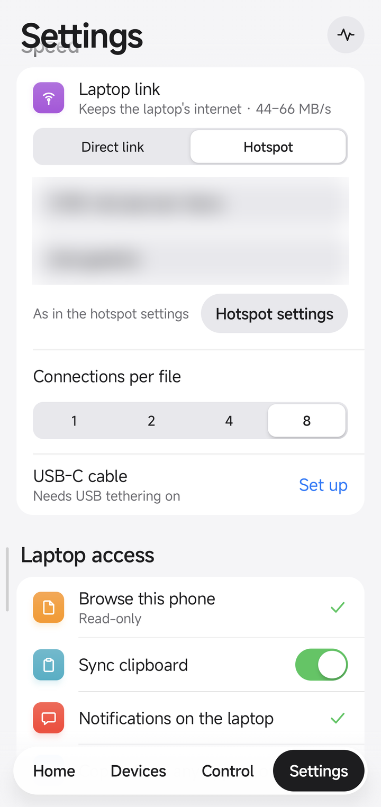 | 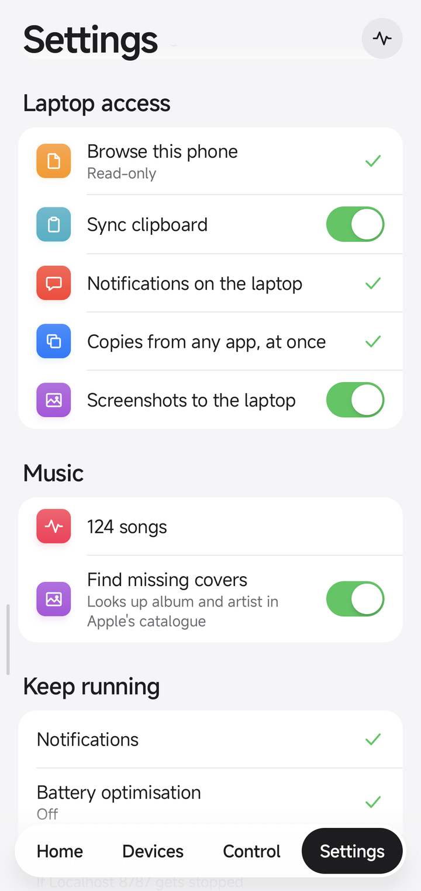 |

## Faster over the air

For hotspot mode, checked on 26 September 2026:

- The phone's hotspot already runs at its best here: 5 GHz, 80 MHz wide, Wi-Fi 6.
- Keep the phone close to the laptop and not face down.
- On the laptop (Device Manager → Wi-Fi adapter → Advanced): turn *Leisure Power Save* off and
  set *Roaming Aggressiveness* to lowest.
- Set the home router to an **80 MHz** channel instead of 20 MHz for faster plain Wi-Fi (some
  Airtel routers lock this; their support can change it).
- 6 GHz Wi-Fi was opened in India in January 2026. Once the phone's software supports it there,
  the hotspot can move to a wider, emptier channel.
- Tried and not worth it: 160 MHz or Wi-Fi 7 on the phone's hotspot (switched off by the
  maker), two links at once, Wi-Fi Direct, more parallel connections, and turning the phone's
  own Wi-Fi off while the laptop is on its hotspot (measured the same either way).

## Under the hood

- The phone runs a small web server (Ktor) in the background; the laptop page is one HTML file
  it serves. Live updates reach the page over a single event stream.
- Uploads use the resumable [tus](https://tus.io) protocol, split over parallel connections
  into one pre-allocated file. Downloads use byte ranges, so they resume too.
- **The tunnel** ([protocol](docs/tunnel-protocol.md)): X25519 keys, HKDF, a SHAKE256 stream cipher
  with HMAC, and streams multiplexed with credit-based flow control, over TCP (IPv6) or over UDP
  after hole punching, where it runs its own sequence numbers, selective acks, RACK loss detection
  and CUBIC. The two sides meet through sealed notes on ntfy.sh and STUN.
- **The website** ([how it works](docs/website.md)): dynv6 for the name (its update URL and REST
  API), Let's Encrypt over ACME with DNS checks (the phone writes the TXT records itself and asks
  dynv6's own nameservers until they have them), a certificate for the name and `lan.` together,
  and a TLS door on port 8443 that hands each connection to the page from its own loopback address,
  so the page knows who came that way.
- Only computers and phones you allow get in: each gets a signed session you can revoke on the
  phone. On the phone's own links traffic is plain HTTP, like a file share on your own Wi-Fi;
  across the internet it is always encrypted, by the tunnel or by HTTPS.
- Phones find each other with DNS-SD (`_blazeit._tcp`) on the local network and link with the
  same pairing as computers, once each way. A **link code** stands in for a device's tunnel key
  for ten minutes (`HMAC("L87L/1 psk", code)`), so the phone typing it can reach the other through
  its tunnel and ask to be let in ([link codes](docs/tunnel-protocol.md#link-codes)).
- **Messages** go phone to phone over the same routes, each sealed with AES-256-GCM under
  `HMAC(psk, "L87M/1 msg")`, the tunnel key the receiving phone made for the sender, with the
  message's id and time bound in ([messages](docs/tunnel-protocol.md#messages)).
- **The laptop's screen**: the helper captures with ffmpeg (Desktop Duplication and NVENC on Windows,
  x11grab, avfoundation or wf-recorder elsewhere) and posts the H.264 stream to the phone's page
  port (`POST /api/display/stream`), so it goes the way the helper reaches the phone, tunnel
  included; the phone decodes it with MediaCodec straight onto the screen.
- **Calls**: WebRTC (`io.github.webrtc-sdk:android`) with the hardware echo canceller and noise
  suppressor, hardware video codecs and Camera2 capture (720p30), STUN only to learn the phone's own
  public address, no TURN. Every connection carries a video transceiver from the start, so the camera
  is a `setTrack` with no renegotiation. Group calls are a mesh of up to four, each pair's offer made
  by the member with the lower id, video capped per sender (1.8, 1.0, 0.7 Mbit/s for one, two, three
  others); the host keeps the roster and relays steps between members it links. Steps go as sealed
  `POST /api/peers/call` (AES-256-GCM under `HMAC(psk, "L87C/1 call")`). Registered with Android
  through Jetpack Core-Telecom, with a `phoneCall`/`microphone`/`camera` foreground service while under way.
- **Music across the internet**: the phone decodes with MediaCodec, halves 88.2/96 kHz with a
  half-band filter, dithers to 16-bit (TPDF) and writes its own FLAC, or encodes AAC; the page
  picks the step from a measured link with 25% to spare. The page itself goes out gzipped.
- A file sent to another computer or phone is a *pipe*: offered, accepted, then streamed through
  in one pass and never stored. A direct send uses WebRTC data channels; the phone passes the
  introductions along the pipe and answers STUN on UDP 3478.
- Lyrics come from [LRCLIB](https://lrclib.net), fetched by the browser for the page and by the
  phone for its own player, and stored on the phone with a `.lrc` file beside the song.
- The phone's own player is Android's MediaPlayer, with the next song prepared and chained on for
  a gapless handover, in a media-playback service with a MediaSession. How loud each 50 ms of a
  song is gets decoded once, at low priority, and kept; the phone's player and the page
  (`/api/music/loudness/{id}`) both draw from it.
- The player's motion is after [Namida](https://github.com/namidaco/namida)'s: one number from 0
  (mini) through 1 (full) to 2 (queue) that every piece is placed from, and the same settling rules
  and curves. It is written anew for Compose and for the page; none of Namida's code is used.
- The music's font is [Lexend Deca](https://fonts.google.com/specimen/Lexend+Deca) (SIL Open Font
  License, `app/src/main/assets/fonts/OFL.txt`), bundled in the app and served to the page from
  `/fonts/`. Its icons are [Iconsax](https://github.com/lusaxweb/iconsax) in its Broken style (MIT
  licence).

## Building

JDK 17+ and the Android SDK (platform 36).

```bash
./gradlew :app:assembleDebug
```

```bash
adb install -r app/build/outputs/apk/debug/app-debug.apk
```

Kotlin and Jetpack Compose on the phone (Android 10+), Ktor 3 for the server; the page has no
build step and no dependencies. The code lives in `app/src/main/`: `assets/bridge.html` (the
page), `assets/blazeit-pc.bat` and `assets/blazeit-helper.py` (the helpers: Windows's, and one for
Linux and the Mac), and `java/dev/periy/bridge/` (`server/` for the routes, uploads, music, lyrics,
linked phones, pipes and notifications, `ui/` for the app's screens, `music/` for the phone's own
player, `net/` for addresses, the direct link, STUN, the tunnel, hole punching and the website).

## Known limits

- Across the internet the speed is the road between the two carriers: 0.13–0.22 MB/s measured
  between Airtel home broadband and a phone on Jio data, too little for 24-bit lossless music.
- A browser needs IPv6 to reach the website; from an IPv4-only network use the helper, which
  punches through. A proxy that allows only web traffic cannot reach the phone at all (Android apps
  cannot listen below port 1024, and the phone is the only server).
- Over the air, 80 MHz Wi-Fi 6 is the most this phone's hotspot offers; for more, use a cable.
- On the direct link the laptop has no internet until the link stops.
- With the hotspot and USB tethering both on, the website's name points at the hotspot side.
- On Linux the second screen works on X11 and on wlroots desktops (sway, Hyprland), not yet on
  GNOME or KDE under Wayland; the trackpad needs `/dev/uinput`, `xdotool` (X11) or `ydotool`. Under
  WSL the Windows helper runs both.
- The Mac helper is written to Apple's documented tools and checked piece by piece, but has not
  yet run on a real Mac. On a Mac the helper does not switch Wi-Fi itself.
- Lyrics need internet on the laptop the first time a song is played; after that they are on
  the phone.
- Protected video cannot be shown on the laptop's screen on the phone.
- Apple Lossless (ALAC) does not play in browsers. Empty folders are not created.
- A free dynv6 name stays active only while the account is used.
- Messages are text only so far, between the phones' apps; the page does not show them yet. A
  message goes only while both phones are on; until then it waits on the sending phone.
- From another network the laptop's screen adjusts its picture on Windows; the Linux and Mac
  helper sends a fixed 1280-wide picture at 1.5 Mbit/s. The laptop's sound is not sent yet.
- Calls are voice only for now, between linked phones. With no relay, a call needs the two phones
  to reach each other directly: on a network that allows only a web proxy (no IPv6, UDP only to a
  few ports) neither calls nor the tunnel get through.
- Linking from anywhere needs one of the two to have IPv6, or the NATs to allow punching (not both
  of the hard kind).
